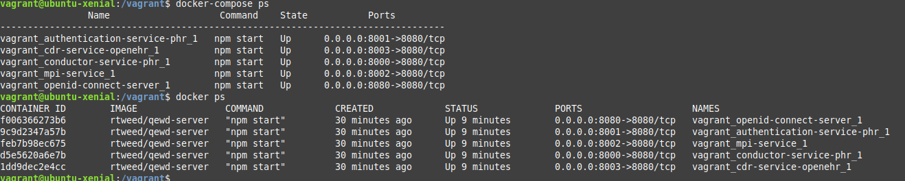
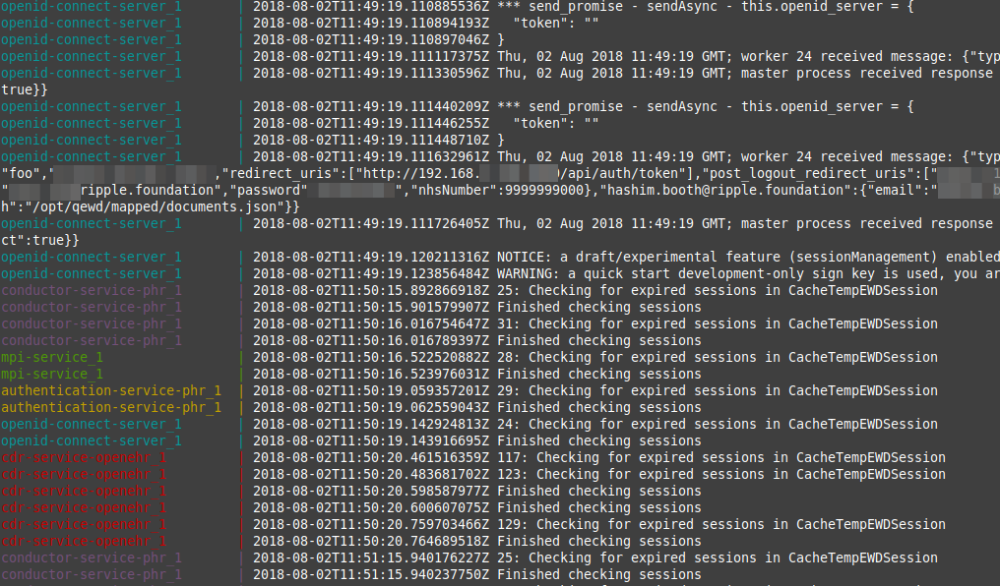

[](https://gitter.im/Ripple-Foundation/General)

<p align="middle">
  <a href="https://ripple.foundation/"></a>
</p>

<p align="middle">
  <a href="https://github.com/PulseTile/PulseTile-React-Core"></a>
  <a href="https://github.com/RippleOSI/Ripple-QEWD-Microservices"></a>
  <a href="https://github.com/ethercis/ethercis"></a>
</p>

# Ripple-Stack-Vagrant-Docker

Development version of the Ripple Stack deployed via Vagrant (for cross-platform usability) and the docker-compose provisioner (for simplicity and minimal configuration)

This repository contains a Vagrantfile and a Docker Compose file which together automate the setup of a working Ripple Stack.

I've started here with some explanation of why this development setup has been chosen, but if you want to just get on with installation, jump to the [Get Ripple Stack](#get-ripple-stack) section.


<!-- TOC depthFrom:1 depthTo:6 withLinks:1 updateOnSave:1 orderedList:0 -->
- [Ripple-Stack-Vagrant-Docker](#ripple-stack-vagrant-docker)
- [Introduction](#introduction)
- [Why use Vagrant and Docker](#why-use-vagrant-and-docker)?
	- [What is Vagrant](#what-is-vagrant)?
	- [What is Docker](#what-is-docker)?
	- [What is Docker Compose](#what-is-docker-compose)?
	- [Why not just do all the setup in the Vagrantfile and let Vagrant do it all](#why-not-just-do-all-the-setup-in-the-vagrantfile-and-let-vagrant-do-it-all)?
- [Requirements and assumptions](#requirements-and-assumptions)
- [Get Ripple Stack](#get-ripple-stack)
- [Run Ripple Stack](#run-ripple-stack)
  - [Monitoring and Troubleshooting](#Monitoring-and-Troubleshooting)
- [Support](#support)
	<!-- - [Some Errors We've Seen]() -->

<!-- /TOC -->

## Introduction
* The Ripple Stack is a suite of software packages (Pulsetile, QEWD-Ripple, and EtherCIS) which are designed to be usable as individual components or all together. This repo contains tools which simplify the use of the whole Ripple Stack all together.
* The purpose of the Ripple Stack is to bring together cutting-edge open source components that can be used to build secure, scalable, interoperable healthcare applications, using modern web standards and openEHR persistence.
* The repo creates a Virtualbox virtual machine containing all the components you need, with minimal further configuration required in order to demo, test and develop on the Ripple Stack.
* If you are more comfortable with native Docker, you can of course opt not to use the Vagrant VM and just use the `docker-compose.yml` within this repo to automate the setup of your stack.
* You can of course use the Dockerized versions of our applications as standalone components as well.

## Why use Vagrant _and_ Docker?
Docker is great but on its own it's not completely at home on all platforms, Windows in particular being a problem, despite the advent of 'Native' GUI applications for Docker on Windows.

In order to make the development experience the same on **all** OS platforms, we've wrapped the development environment in a headless virtual machine (which is actually how the Ripple stack developer documentation suggests to do it anyway). Virtual machines work on all platforms and the Ubuntu guest that is created then gives us a consistent and reproducible development environment on all platforms.

Inside this VM we use [Docker](https://www.docker.com/what-docker) and [docker-compose](https://docs.docker.com/compose/) to orchestrate the creation of all of the Ripple Stack components inside the VM, and these are all preconfigured to be able to communicate with each other. This process has reduce the setup complexity of the Ripple Stack from a 25-page document down to a few lines of commands.

### What is Vagrant?
Vagrant is an automation layer that allows programmatic setup of a Virtual Machine, using any provider (eg Virtualbox, QEMU, VMWare etc) and on any platform. It means we can state which 'base box' we want to use (in this case it's Ubuntu 16.04, but it could be anything) and then specify what setup needs to be applied to that base box, eg networking, forwarded ports, shared drives, etc. If you look at our [Vagrantfile](Vagrantfile) you can see fairly easily what is going on, it's a nice clean syntax.

### What is Docker?
Docker is a tool which greatly simplifies the use of Linux Containers, which you can envisage as a 'super-lightweight virtual machine' which interfaces directly at Linux kernel level, doing away with much of the inefficiency of traditional Virtual Machines. Because they are so lightweight and performant, the technology has  enabled individual software products like web servers or databases to be packaged and distributed in Docker containers, which have all the right dependencies pre-packaged in the container. This is great when you're setting up a complex environment and, for example, your stack has components which need *different* Java versions, or Ruby versions, or whatever. Each Docker container would contain it's *own* correct Java or Ruby version, and there is no dependency conflict.

### What is Docker Compose?
Docker Compose is another tool which comes with Docker, which enables programmatic setup and networking of **multiple** Docker containers. In this case we're using Docker Compose to provision several Docker containers inside Ubuntu VM once Vagrant has done creating it. Docker Compose creates an internal network inside our Virtual Machine, and automatically plugs all the Docker containers into it so they are connected together.

#### Why not just do all the setup in the Vagrantfile and let Vagrant do it all?
Good question. You totally could do this and it would also work. Vagrant can be instructed to set up each of the Docker containers in the Vagrantfile. However, Docker Compose is a much more portable tool, which can be used in other contexts, so having a working `docker-compose.yml` for the Ripple Stack enables the exact same code to be used again for  configuration of a Docker-only setup, for Boot2Docker, even for live deployments if necessary and appropriate.

Here's a good intro to Docker and VMs for those wanting more help https://medium.freecodecamp.org/a-beginner-friendly-introduction-to-containers-vms-and-docker-79a9e3e119b

## Requirements and assumptions
* I am assuming a Unixy platform (MacOS or Linux) in the commands below, but the steps are the same for all platforms.
* You should have some familiarity with the command line in your platform
* You should have a Virtual Machine provider installed already (Virtualbox ideally)
* You will need a decent bandwidth Internet connection to download Vagrant, the virtual machine base box, Docker images, and all the NPM modules that are needed (this happens under the hood as each Docker container sets itself up)
* You will need Vagrant. Instructions for this vary depending on your platform, so please [go to the Vagrant website](https://www.vagrantup.com/downloads.html) for details


# Get Ripple Stack

Navigate to wherever you are going to keep your development files, and create a folder to contain all the code for the Ripple Stack.

```sh
mkdir ripple
cd ripple
git clone https://github.com/pacharanero/ripple-stack-vagrant-docker.git ripple-stack # Puts this repository in ripple-stack
git clone https://github.com/PulseTile/PulseTile-React-Core.git ripple-pulsetile # Puts Pulsetile in ripple-pulsetile
git clone https://github.com/RippleOSI/Ripple-QEWD-Microservices ripple-qewd # Puts QEWD in ripple-qewd
```

You should now have several subdirectories in your development directory, one for each of the Ripple components.

```
ripple
    ├── ripple-pulsetile
    ├── ripple-qewd
    └── ripple-stack
```

*The reason for separating the repos in directories is so that you can do local development work on *any* of those components and still preserve the Git history of each separate repo. If we put them all in one folder we can get `git chaos`.*

### Configuration

The default IP for the Stack VM is `192.168.50.100`.

You need to enter this IP into various configuration files as per the instructions at https://github.com/RippleOSI/Ripple-QEWD-Microservices#configuration.

Sorry. We are working on eliminating this step with automagicalness.


# Run Ripple Stack

`vagrant up stack`

Vagrant will import our Vagrantbox `rippleosi/headless` and start the VM. Then Docker will fetch the Ripple stack containers and start the services.

There are [alternative versions of the Stack in the Vagrantfile](docs/vagrant.md).


## Monitoring and Troubleshooting
To get inside your Vagrant Virtual Machine to see what's going on, type `vagrant ssh`

You can check that the Docker containers were all created and are on the correct ports by typing `docker-compose ps` or `docker ps` which lists all the running Docker containers in the VM. You should see an output a bit like this, showing the services, each with a named container, and port mapping etc.



To see the logs of **all** the different services all together, with nice colour highlighting for each service and timestamps, you can use `docker-compose logs -f -t` to connect to the logging output. (the switches `-f` and `-t` make the output 'follow' and 'timestamped' respectively). To disconnect without stopping the containers, just use Ctrl+C. You should see something like the following output:




# Support
For support please talk to us in our open chat channel https://gitter.im/Ripple-Foundation/General
[](https://gitter.im/Ripple-Foundation/General)

### Some Errors We've Seen
```
ERROR: 'client_id is required' =>
ERROR: 'token is invalid' =>
```
`git checkout` the yottadb/ directory again - it's been corrupted
